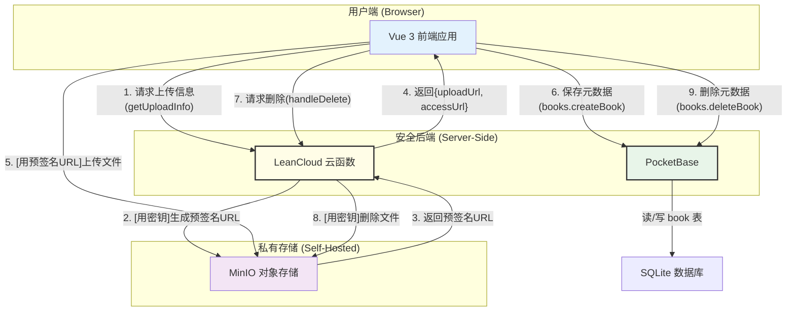
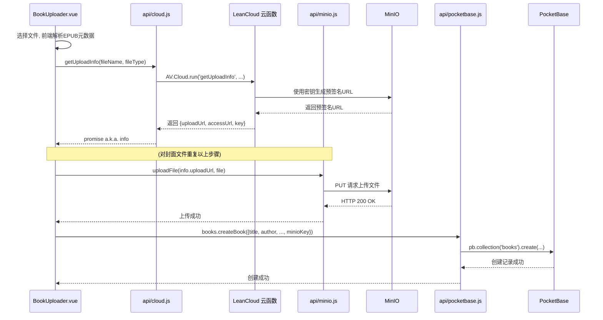
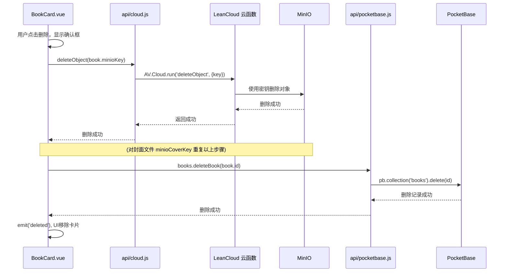

| 项    <div style="width:100px;text-align: center;">                | 内容                                                                     |
| --------------------- | ------------------------------------------------------------------------ |
| **项目名称**           | iReader Pro 个人电子书库                                                 |
| **文档版本**           | V2.0 (基于核心代码审查更新)                                              |
| **编写日期**           | 2023年10月27日                                                           |
| **核心技术栈**          | Vue 3, Vite, Element Plus, **PocketBase**, **LeanCloud**, MinIO            |
| **编写者**            | [你的名字] & AI Senior Software Engineer                                     |
| **文档目的**            | 详实记录项目的技术架构、数据模型、业务流程和核心代码实现，确保文档的准确性、真实性，为项目的迭代、维护和知识沉淀提供可靠依据。 |

---

## 1. 需求分析 (Requirements Analysis)

### 1.1 项目背景与目标
本项目旨在为用户提供一个私有化、功能完善的电子书管理平台，解决个人电子书（EPUB格式）的集中存储、元数据管理、封面展示和跨设备访问需求。

### 1.2 功能性需求 (Functional Requirements)
- **FR1: 电子书上传与解析**
  - **FR1.1:** 用户可通过拖拽或点击的方式，批量上传本地的 `.epub` 文件。
  - **FR1.2:** 系统在前端应对上传的 `.epub` 文件进行解析，自动提取书名（title）、作者（author）和封面图片（cover image）。
  - **FR1.3:** 文件上传流程需包含 EPUB 文件本体和提取出的封面图片。
- **FR2: 电子书库展示**
  - **FR2.1:** 在主页以卡片墙的形式展示所有已上传的电子书。
  - **FR2.2:** 每个图书卡片默认展示封面。当鼠标悬停时，以磨砂玻璃效果显示书名、作者及操作按钮（阅读、删除）。
- **FR3: 电子书删除**
  - **FR3.1:** 用户可对任意一本图书执行删除操作。
  - **FR3.2:** 删除前需有模态框进行二次确认，防止误操作。
  - **FR3.3:** 删除操作必须是**事务性的**：需同时删除数据库中的元数据记录、对象存储中的图书文件，以及对象存储中的封面文件。

### 1.3 非功能性需求 (Non-Functional Requirements)
- **NFR1: 安全性**: MinIO 的访问密钥（Access Key & Secret Key）**严禁**在前端暴露。所有需要使用密钥的操作（如生成上传URL、删除文件）必须在安全的后端环境（LeanCloud 云函数）中执行。
- **NFR2: 健壮性**: 对文件解析失败、网络请求错误、API调用失败等异常情况进行捕获和处理，并向用户提供明确的UI反馈（如 `ElMessage`, `ElNotification`）。
- **NFR3: 用户体验**: 上传过程应有明确的进度指示；删除操作时应锁定卡片并显示加载状态，避免用户重复操作。
- **NFR4: 模块化**: 前端代码应高度模块化，将视图（Components）、API调用（api）、业务服务（utils/services）和状态管理清晰分离。

---

## 2. 概要设计 (High-Level Design)

### 2.1 系统架构：精巧的混合后端模式
本项目采用了一种先进的混合后端（Hybrid BaaS）架构。它并非单一依赖某个后端服务，而是**将 LeanCloud 云函数和 PocketBase 巧妙地结合，发挥各自最大的优势**。

- **PocketBase**: 担任**“数据中台”**角色。负责存储和管理结构化的书籍元数据，提供高速的数据库 CRUD (增删改查) API。
- **LeanCloud 云函数**: 担任**“安全网关”**和**“服务代理”**角色。所有与 MinIO 的敏感操作（需要密钥）都在这里完成，为前端提供一个安全的、封装好的接口。



**架构优势分析**:
- **职责清晰**: PocketBase 专注其最擅长的数据管理。LeanCloud 专注其最擅心的、需要安全环境和自定义逻辑的后端任务。
- **极致安全**: MinIO 的密钥被完美地隔离在 LeanCloud 云函数的环境中，前端代码完全接触不到，从根本上杜绝了密钥泄露的风险。
- **灵活性高**: 未来的复杂业务逻辑（如对接邮件服务、图像处理等）可以方便地在 LeanCloud 云函数中扩展，而无需改变 PocketBase 的简单性。

### 2.2 技术选型论证

| 技术/框架         | 在项目中的角色与选型理由                                                                                             |
| ----------------- | ---------------------------------------------------------------------------------------------------------------------- |
| **Vue 3**         | Composition API 极大提升了复杂组件（如 `BookUploader.vue`）的逻辑组织和复用能力。                                        |
| **Element Plus**  | 提供了一整套高质量、开箱即用的UI组件（`ElUpload`, `ElDialog`, `ElMessageBox`, `ElLoading`），是项目UI快速成型的基石。 |
| **PocketBase**    | 作为**元数据引擎**。提供极简的部署和高速的 RESTful API，用于存储和查询 `books` 集合，简化了常规的数据库管理工作。 |
| **LeanCloud 云函数** | 作为**安全代理**。提供一个 Node.js 运行环境，用于安全地存放 MinIO 密钥，并使用 `aws-sdk` 与 MinIO 通信，实现生成预签名URL和删除文件等敏感操作。 |
| **MinIO**         | 作为**文件存储仓库**。提供与 S3 兼容的高性能对象存储服务，用于持久化存储 EPUB 文件本体和封面图片。          |
| **aws-sdk**       | 在 LeanCloud 云函数中被用于以编程方式与 MinIO（S3兼容）进行交互的标准库。                                          |

---

## 3. 详细设计 (Detailed Design)

### 3.1 API 服务层 (`src/api/`)
前端 API 层结构清晰，体现了对不同后端服务的封装隔离。

- **`api/index.js`**: API 的统一出口，整合了所有 API 模块。
- **`api/cloud.js`**: 封装了所有与 **LeanCloud 云函数**的交互。使用 `AV.Cloud.run` 方法调用云端定义的 `getUploadInfo` 和 `deleteObject` 函数。
- **`api/minio.js`**: 封装了**前端**与 **MinIO** 的直接交互。值得注意的是，它只负责使用**已获取的预签名URL**执行 `PUT` 上传操作，自身不包含任何认证逻辑。
- **`api/pocketbase.js`**: 封装了所有与 **PocketBase** 的交互。通过 `pocketbase-js` SDK，提供了 `createBook`, `getAllBooks`, `deleteBook` 等针对 `books` 集合的原子操作。

### 3.2 PocketBase 数据模型 (`books` collection)
基于 `pocketbase.js` 和 `BookUploader.vue` 的代码，`books` 集合的字段定义如下：

| 字段名          | 类型   | 约束/选项 | 描述                                         |
| --------------- | ------ | --------- | -------------------------------------------- |
| `id`            | `ID`   | 主键      | PocketBase 自动生成的记录唯一 ID。           |
| `title`         | `Text` | `Required`| EPUB 文件解析出的书名。                      |
| `author`        | `Text` | `Required`| EPUB 文件解析出的作者。                      |
| `bookUrl`       | `URL`  | `Required`| EPUB 文件在 MinIO 中的**公开可访问 URL**。   |
| `coverUrl`      | `URL`  | `Optional`| 封面图片在 MinIO 中的**公开可访问 URL**。    |
| `minioKey`      | `Text` | `Required`| EPUB 文件在 MinIO 存储桶中的**对象键 (路径)**。 |
| `minioCoverKey` | `Text` | `Optional`| 封面图片在 MinIO 存储桶中的**对象键 (路径)**。|

*设计关键点：同时存储 `accessUrl` 和 `minioKey` 是一个优秀的设计。`accessUrl` 用于前端快速展示（如 `` 的 `src`），而 `minioKey` 则作为文件的唯一标识，用于后台操作（如删除）。*

### 3.3 核心业务流程 - 图书上传 (Sequence Diagram)



### 3.4 核心业务流程 - 图书删除 (Sequence Diagram)


*流程关键点：前端组件 `BookCard.vue` 作为**总指挥**，依次调用 `cloud.js` (删除文件) 和 `pocketbase.js` (删除记录)，清晰地编排了整个删除事务。*

---

## 4. 核心代码实现解析

### 4.1 安全后端：LeanCloud 云函数 (`cloud.js` - Server Side)
这是整个系统安全性的基石。它安全地持有MinIO密钥，并向前端暴露了两个无害的接口。

**`getUploadInfo` 函数**:
```javascript
// LeanCloud 云函数 (Server Side)
const s3 = new AWS.S3({ /* ... securely configured with keys ... */ });

AV.Cloud.define('getUploadInfo', async (request) => {
    // ...
    // 生成一个在存储桶中唯一的 key
    const key = `${...}/${Date.now()}-${fileName}`;
    
    const params = { Bucket: MINIO_BUCKET, Key: key, ... };

    // 1. 生成有时效性的、用于上传的 URL
    const uploadUrl = await s3.getSignedUrlPromise('putObject', params);
    
    // 2. 构建永久性的、用于访问的 URL
    const accessUrl = `${MINIO_ENDPOINT}/${MINIO_BUCKET}/${key}`;

    // 3. 将三个关键信息返回给前端
    return { key, uploadUrl, accessUrl };
});
```
**解析**: 此函数完美地实践了“预签名URL”模式。前端只拿到一个临时的“上传许可证” (`uploadUrl`)，而无需知道任何密钥信息。

**`deleteObject` 函数**:
```javascript
// LeanCloud 云函数 (Server Side)
AV.Cloud.define('deleteObject', async (request) => {
    const { key } = request.params;
    // ... validation ...
    const params = { Bucket: MINIO_BUCKET, Key: key };
    
    // 直接在后端调用 AWS SDK 的删除方法
    await s3.deleteObject(params).promise();

    return { success: true, ... };
});
```
**解析**: 删除操作同样被安全地封装。前端只需提供文件的`key`，由拥有权限的后端环境来执行真正的删除动作。

### 4.2 前端上传总指挥：`BookUploader.vue`
此组件是上传功能的核心，其 `handleHttpRequest` 方法清晰地展示了上传流程的编排。

```javascript
// BookUploader.vue
const handleHttpRequest = async ({ file, onProgress, onSuccess, onError }) => {
    try {
        // ...
        // --- 1. 获取 EPUB 文件的上传信息 ---
        const epubInfo = await getUploadInfo(...);
        // 使用该信息上传文件
        await uploadFile(epubInfo.uploadUrl, ...);

        // --- 2. 获取并上传封面（如果存在） ---
        let coverAccessUrl = null, minioCoverKey = null;
        if (fileMetadata.coverBlob) {
            const coverInfo = await getUploadInfo(...);
            await uploadFile(coverInfo.uploadUrl, ...);
            coverAccessUrl = coverInfo.accessUrl;
            minioCoverKey = coverInfo.key;
        }

        // --- 3. 所有文件上传完毕，将元数据写入 PocketBase ---
        await books.createBook({
            title: fileMetadata.title,
            author: fileMetadata.author,
            bookUrl: epubInfo.accessUrl,
            coverUrl: coverAccessUrl,
            minioKey: epubInfo.key,
            minioCoverKey: minioCoverKey,
        });
        
        onSuccess();
    } catch (error) {
        onError(error);
    }
};
```
**解析**: 此方法是概要设计中“上传流程”的直接代码体现。它以事务性的方式，按顺序执行了获取上传凭证、上传文件、保存元数据三个步骤，逻辑严谨，错误处理到位。

### 4.3 前端删除总指挥：`BookCard.vue`
此组件的 `handleDelete` 方法同样体现了前端作为指挥官，调用不同微服务完成一个完整业务。

```javascript
// BookCard.vue
const handleDelete = async (event) => {
    // ... ElMessageBox.confirm ...
    try {
        const loadingInstance = ElLoading.service({ target: bookCardRef.value, ... });
        try {
            // 1. 调用云函数，删除 MinIO 中的图书文件
            await deleteObject(props.book.minioKey);
            // 2. 如果有封面，也调用云函数删除
            if (props.book.minioCoverKey) {
                await deleteObject(props.book.minioCoverKey);
            }

            // 3. 文件都删除后，再删除 PocketBase 中的数据库记录
            await books.deleteBook(props.book.id);
            
            ElMessage.success('删除成功!');
            emit('deleted', props.book.id);
        } catch (error) {
            // ... error handling ...
        } finally {
            loadingInstance.close();
        }
    } catch(cancel) { /* ... */ }
};
```
**解析**: 这段代码是“删除流程”的完美实现。它清晰地展示了先处理外部资源（MinIO文件），再处理内部记录（PocketBase数据）的稳妥策略。`try...catch...finally` 结构确保了无论成功与否，loading 状态都会被正确移除。

---

## 5. 总结与展望

### 5.1 项目总结
V2.0 版本的 iReader Pro 项目，通过采用 **LeanCloud + PocketBase** 的混合后端架构，成功实现了一个功能完备、安全可靠且体验优秀的核心 MVP。
- **架构优势**: 该架构兼具 PocketBase 的开发便捷性与 LeanCloud 云函数的安全性和灵活性，为个人项目或小型团队提供了一个极佳的工程实践范例。
- **代码质量**: 前端代码遵循了现代化的组件化和模块化思想，API 服务层封装良好，核心业务组件逻辑清晰、健壮。
- **功能完整**: 完整实现了从文件解析、安全上传、元数据存储到关联删除的全链路功能闭环。

### 5.2 后续工作展望
- **用户系统**: 结合 PocketBase 或 LeanCloud 其中一方提供的用户认证功能，实现多用户的书库隔离。
- **在线阅读器**: 集成 `epub.js` 库，利用已有的 `bookUrl` 实现电子书的在线阅读功能。
- **全站搜索**: 增加基于书名、作者的搜索功能，可直接利用 PocketBase 的过滤 API 实现。
- **数据同步**: 利用 PocketBase 的实时订阅（Realtime）功能，实现多端打开页面时，书库的实时自动更新，无需手动刷新。
- **运维部署**: 为 LeanCloud 和 PocketBase 的部署编写 Dockerfile，实现容器化一键部署。
